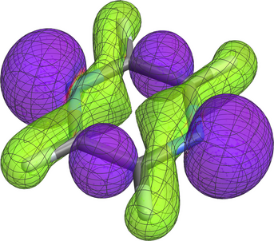

# Plotting complex orbitals from cube file data

A Mathematica notebook for plotting the isosurface of the absolute value
of a complex orbital. The isosurface is colored with the complex phase
of the orbital according to the color wheel shown below. 

*Note: In Mathematica 13.1, the combined rendering of molecules and isosurfaces based on cube file imports is broken. I was notified by Wolfram Technical Support that this is a known issue, which will hopefully be fixed in upcoming releases. For the time being, please use version 13.0 for the orbital visualization notebook, or one of the version 12 releases.*

The functionality was used to generate the orbital visuals in this article:

Rulin Feng, Xiaojuan Yu, Jochen Autschbach, Spin-orbit Natural Transition Orbitals and Spin-forbidden Transitions, J. Chem. Theor. Comput., (2021), 12, 7531. https://doi.org/10.1021/acs.jctc.1c00776 

Works (should work) with Mathematica 12.1 or higher. 

The notebook is also available at the Wolfram Foundation's Notebook
Archive: https://notebookarchive.org/2022-02-471gnt6/

